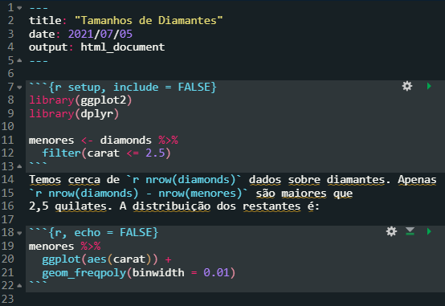
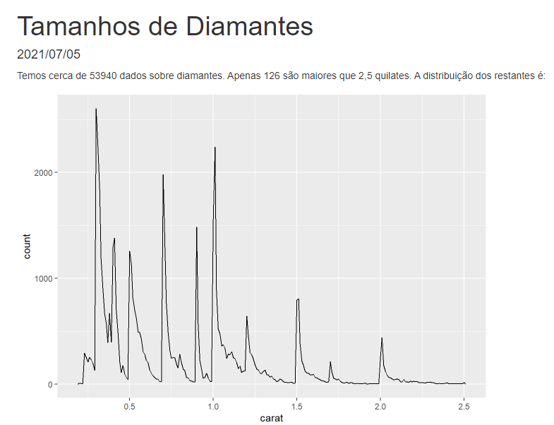

# Quem somos?
```{r ,echo=FALSE, out.width="40%",fig.align="center", fig.cap="Thiago Miranda"}

```
<center> Analista de Business Intelligence e Analytics na Catho </center>
<center> `r icons::fontawesome("linkedin")` thiiagofmiranda </center>
<center> `r icons::fontawesome("instagram")` fm.thiago </center>
---
# Quem somos?
```{r ,echo=FALSE, out.width="40%",fig.align="center", fig.cap="Rodrigo Almeida"}

```
<center> People Analytics na Dasa </center>
<center> `r icons::fontawesome("linkedin")` rodrigoalmeidafigueira </center>
<center> `r icons::fontawesome("instagram")` rodrigo.alm93 </center>
---
# Rmarkdown
* Introdução
* Como funciona
* Markdown Básico
* Chunks
* Imagens
* Tabelas
* Formatos de Saída
* RPubs
---
# Referências
* R para Data Science - Hadley Wickham
* R Markdown Cookbook - Yihui Xie
---
# Introdução
<p align='justify'>Até agora aprendemos ferramentas do R para extrair, transformar, analisar, modelar. Uma etapa tão importante quanto, é aprensentar/comunicar o que foi analisado. No curso de R Markdown aprenderemos a como criar relatórios diretamente pelo R, onde veremos como funciona a sintaxe básica do rmarkdown. Veremos também os principais formatos de arquivos de saída (notebooks, slides, word, html e pdf).</p>

Os arquivos R Markdown são projetados para serem usados de três maneiras:
  
1. <p align='justify'>Para se comunicar com os tomadores de decisão, que desejam se concentrar nas conclusões, não no código por trás da análise (Relatório);</p>
2. <p align='justify'>Para colaborar com outros cientistas de dados, que estão interessados em suas conclusões e como você chegou até elas (Relatório e Código);</p>
3. <p align='justify'>E como documentação, onde você pode capturar não apenas o que fez, mas também a sua linha de raciocínio.</p>

---
# Como funciona

Pré-requisito: Você precisa do pacote rmarkdown, o RStudio instala automaticamente.

Este é um arquivo R Markdown, um arquivo de texto simples que possui a extensão .Rmd:

```{r ,echo=FALSE, out.width="80%",fig.align="center"}

```

---
# Como funciona
Output:
```{r ,echo=FALSE, out.width="80%",fig.align="center"}

```

---
# Como funciona

<p align='justify'>Quando você <i>knitr</i> o documento, o arquivo <b>.Rmd</b> é enviado para o <b>knitr</b>(http://yihui.name/knitr/), que executa todos os blocos de códigos e cria um novo documento de marcação <b>.md</b> que inclui os códigos e seus resultados. O arquivo markdown gerado pelo knitr é então processado por <b>pandoc</b>(http://pandoc.org/), que é responsável por criar o arquivo finalizado.</p>

```{r ,echo=FALSE, out.width="80%",fig.align="center"}
knitr::include_graphics("imagens/rmarkdownflow.png")
```

<p align='justify'>A vantagem desse fluxo de trabalho de duas etapas é que você pode criar uma ampla variedade de formatos de saída, conforme aprenderá nos formatos R markdown.</p>

---
# Como funciona

## <p align='center'>Vamos para o R!</p>

